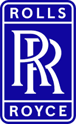

# Rolls-Royce Engine Performance Cycle Deck

A Rolls-Royce branded demo of gas-turbine cycle analysis. It solves a high-bypass
turbofan at its cruise design point, then re-solves it across a flight-envelope
sweep and presents thrust, fuel burn, pressure ratio and turbine entry
temperature as a branded table and branded plots.

The engine model is the unmodified upstream pyCycle example
(`example_cycles/high_bypass_turbofan.py`, NASA / OpenMDAO). Everything in
`rr_demo/` is presentation and orchestration only — no new cycle physics.

## Install

```bash
pip install -e .[all]
pip install -r rr_demo/requirements.txt
```

## Run the command line deck

```bash
python -m rr_demo.run_demo                 # design point + 5-point sweep
python -m rr_demo.run_demo --points 3      # shorter run
python -m rr_demo.run_demo --thermo CEA    # upstream reference thermodynamics
python -m rr_demo.run_demo --throttle 0.8  # part-power setting
```

Output: a blue-header cycle summary table in the terminal, plus two branded PNGs
in `rr_demo/outputs/`:

| File | Contents |
| ---- | -------- |
| `rr_cycle_summary.png` | Cycle summary table, Rolls-Royce blue header |
| `rr_flight_envelope.png` | Thrust, TSFC, OPR and T4 versus flight Mach number |

## Run the dashboard

```bash
streamlit run rr_demo/app.py
```

Open <http://localhost:8501>. Set Mach, altitude and throttle in the sidebar,
press **Run cycle** for a single operating point, or **Run flight envelope** for
the branded sweep plot.

## Runtime

Thermodynamics defaults to `TABULAR`, which keeps the demo interactive:

| Step | TABULAR | CEA |
| ---- | ------- | --- |
| Build and solve the design deck | ~25 s | ~90 s |
| Each additional off-design point | ~4-7 s | ~25 s |
| Full CLI demo (design + 5 points) | ~1 min | ~4 min |

`CEA` reproduces the upstream reference answers and is available via
`--thermo CEA` or the sidebar selector.

## Branding

Rolls-Royce blue `#10069F` on white, light grey `#F2F2F4` surfaces, `#E5E5EA`
borders and near-black `#111111` text, applied to the CLI banner and tables, the
matplotlib theme in `branding.py`, and the Streamlit theme in
`.streamlit/config.toml`. The badge logo lives at
`docs/assets/rolls-royce-logo.png` and is used as the app logo, favicon and plot
header mark.

## Attribution

pyCycle is © NASA / OpenMDAO contributors and is licensed under the terms in the
repository `LICENSE.txt`. This demo does not claim authorship of the upstream
library or its cycle physics.
